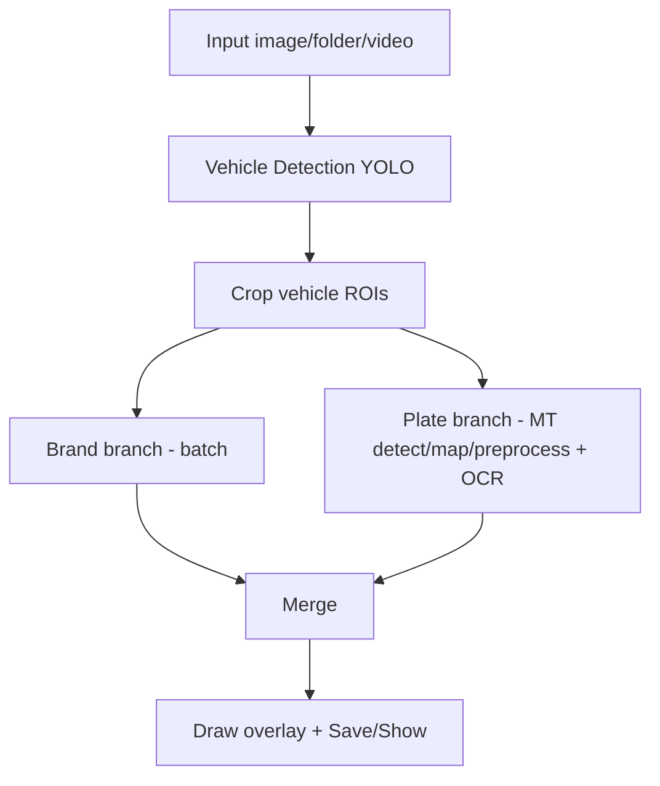

# OCR Plate (C++ / ONNX Runtime / OpenCV)

Dự án nhận diện phương tiện, phân loại hãng xe và OCR biển số bằng C++ với ONNX Runtime + OpenCV.

Hỗ trợ input: `--image`, `--folder`, `--video`.

## 1) Pipeline

Luồng xử lý mỗi lần infer (1 ảnh / 1 frame infer):

1. **Vehicle detection (YOLO)** trên ảnh gốc.
2. **Crop vehicle ROI** từ bbox vehicle.
3. **Chạy song song 2 nhánh**:
   - **Brand branch**: batch classify hãng xe cho `car`.
   - **Plate branch**:
     - plate detect theo từng vehicle (multi-thread).
     - map bbox plate về ảnh gốc.
     - crop + preprocess plate (multi-thread).
     - OCR (batch; nếu model OCR fix `batch=1` thì fallback multi-thread theo từng ảnh).
4. **Merge kết quả** vehicle + plate + OCR text/conf.
5. **Draw overlay** và xuất ảnh/video.



ONNX Runtime được vendor sẵn trong `third_party/onnxruntime`.

## 2) Tracking (video)

Trong mode video, hệ thống dùng `tracking-by-detection` để gán `track_id` ổn định cho vehicle theo thời gian.

Hiện tại tracker được implement theo hướng **ByteTrack-like**:

- Predict bbox mỗi frame (để chạy tốt khi chỉ infer mỗi N frame).
- Data association 2-stage (high-score rồi low-score) + assignment toàn cục (giảm `id switch`).

Ngoài `track_id`, hệ thống duy trì map nghiệp vụ: `track_id -> {brand, plate}` và chỉ “chốt” khi đủ ngưỡng:

- brand: `brand_conf > kTrackBrandAcceptConf`
- plate: `plate_det_conf > kTrackPlateDetAcceptConf` và `ocr_conf_avg > kTrackPlateOcrAcceptConf`

Nếu một track đã đủ brand/plate hợp lệ, các frame sau sẽ bỏ qua phần nhận diện tương ứng để giảm compute.

## 3) Yêu cầu

- Linux (khuyến nghị Ubuntu 22.04)
- CMake + compiler hỗ trợ C++23
- OpenCV dev

`setup.sh` cài sẵn:

- `build-essential`
- `cmake`
- `pkg-config`
- `libopencv-dev`

## 4) Quick start

```bash
./setup.sh
./build.sh
cd build
../run.sh --image ../img/1.jpeg
```

Nếu script chưa executable:

```bash
chmod +x setup.sh build.sh run.sh
```

## 5) Build

Mặc định build 2 target: `main` và `benchmark`.

```bash
./build.sh
```

Tùy chọn:

- `--build-type <type>` (mặc định `Release`)
- `--jobs <n>`
- `--clean`
- `--target <name>` (lặp được)

Ví dụ:

```bash
./build.sh --build-type Debug --jobs 8
./build.sh --clean --target benchmark
```

Output:

- `out/build/bin/main`
- `out/build/bin/benchmark`

Ghi chú: nếu bạn từng build trên môi trường khác (ví dụ cache compiler trỏ tới `*.exe`), hãy chạy `./build.sh --clean` để tạo cache mới.

## 6) Chạy

Main:

```bash
../run.sh --image ../img/1.jpeg
../run.sh --folder ../img
../run.sh --video ../video.mp4 --show --nosave
```

Benchmark:

```bash
../run.sh --benchmark --image ../img/10.jpeg --warmup 3 --runs 10
```

Video note:

- infer theo chu kỳ `app_config::kVideoInferEveryNFrames` (mặc định 5), các frame giữa chu kỳ tái dùng overlay gần nhất.

## 7) Cấu hình

Thiết lập trong `include/ocrplate/core/app_config.h`:

- Model paths: `kVehicleModelPath`, `kPlateModelPath`, `kBrandCarModelPath`, `kOcrModelPath`
- Thresholds: `kVehicleConfThresh`, `kPlateConfThresh`, `kNmsIouThresh`, `kOcrConfAvgThresh`
- Video/tracking: `kVideoInferEveryNFrames`, các biến `kTracker*`, các biến `kTrack*AcceptConf`

## 8) Docker

```bash
docker build -t ocr-plate .
docker run --rm -v "$PWD/img:/app/img" ocr-plate --image /app/img/1.jpeg
docker run --rm -v "$PWD/img:/app/img" --entrypoint /app/benchmark ocr-plate --image /app/img/1.jpeg --warmup 3 --runs 10
```

## 9) Cấu trúc project (production-like)

Public headers nằm dưới `include/ocrplate/*` (module hoá theo folder), source nằm dưới `src/*`:

- `src/app/*`: entrypoints + CLI parsing
- `src/pipeline/*`: pipeline infer/draw
- `src/services/*`: model runners (YOLO/OCR/Brand/ONNX)
- `src/utils/*`: util chung (parallel, decode, report, preprocess)
- `src/tracking/*`: tracking + identity store

Các module được build thành library targets trong `CMakeLists.txt`:

- `ocrplate_utils`, `ocrplate_tracking`, `ocrplate_services`, `ocrplate_pipeline`

