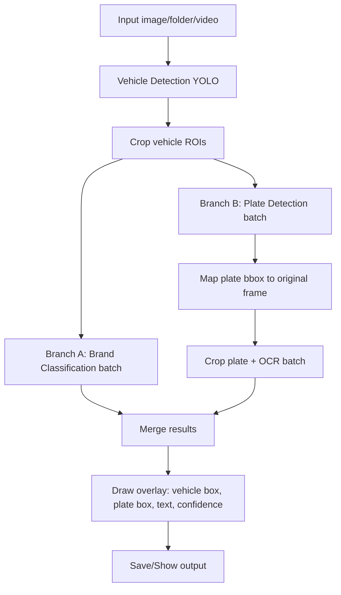

# OCR Plate (C++ / ONNX Runtime / OpenCV)

Dự án nhận diện biển số xe bằng C++ với ONNX Runtime + OpenCV.

## Pipeline xử lý (chi tiết)

Đầu vào hỗ trợ 3 chế độ: `--image`, `--folder`, `--video`.

Luồng xử lý cho mỗi frame/ảnh:

1. **Vehicle Detection (YOLO)**
   - Tìm các phương tiện trong ảnh/frame.
2. **Crop Vehicle ROI**
   - Cắt từng vùng phương tiện để xử lý theo batch.
3. **Chạy song song 2 nhánh trên batch vehicle**
   - **Nhánh A - Brand Classification**: dự đoán hãng xe cho từng vehicle crop.
   - **Nhánh B - Plate + OCR**:
     - Detect biển số trong từng vehicle crop.
     - Map bbox biển số về tọa độ ảnh gốc.
     - Crop biển số và OCR batch để ra text + độ tin cậy.
4. **Ghép kết quả & vẽ overlay**
   - Vẽ bbox phương tiện, bbox biển số, label (brand + plate text + confidence).
5. **Output**
   - Image/Folder: ghi ảnh annotate.
   - Video: ghi video annotate và overlay FPS.

Sơ đồ tổng quan:



ONNX Runtime đã được vendor sẵn trong `third_party/onnxruntime`.

## Quick start (dùng script có sẵn)

Từ thư mục root dự án:

```bash
# 1) Cài dependencies hệ thống
./setup.sh

# 2) Build
./build.sh

# 3) Chạy main với 1 ảnh
./run.sh --image img/1.jpeg
```

Nếu script chưa có quyền thực thi:

```bash
chmod +x setup.sh build.sh run.sh
```

## 1) Yêu cầu

- Linux (khuyến nghị Ubuntu 22.04)
- `apt` để cài gói hệ thống
- CMake + compiler hỗ trợ C++23

`setup.sh` sẽ cài các gói:

- `build-essential`
- `cmake`
- `pkg-config`
- `libopencv-dev`

## 2) Setup môi trường (`setup.sh`)

```bash
./setup.sh
```

Option:

- `--no-sudo`: chạy `apt` không qua `sudo`
- `--skip-update`: bỏ qua bước `apt update`
- `--help` / `-h`: xem trợ giúp

Ví dụ:

```bash
./setup.sh --no-sudo --skip-update
```

## 3) Build (`build.sh`)

Lệnh mặc định build 2 target: `main` và `benchmark`.

```bash
./build.sh
```

Option:

- `--build-type <type>`: mặc định `Release`
- `--jobs <n>`: số luồng build (mặc định `nproc`)
- `--clean`: xoá `build/` và `out/build/` trước khi build
- `--target <name>`: target build (có thể lặp nhiều lần)

Ví dụ:

```bash
./build.sh --build-type Debug --jobs 8
./build.sh --clean --target main
```

Binary output:

- `out/build/bin/main`
- `out/build/bin/benchmark`

## 4) Chạy ứng dụng (`run.sh`)

### Main mode (mặc định)

Chọn một trong các mode input:

- `--image <path_anh>`
- `--folder <path_thu_muc_anh>`
- `--video <path_video>`

Tùy chọn hiển thị:

- `--show`
- `--no-show` (mặc định)

Tùy chọn lưu output:

- Mặc định luôn lưu file output (`*_annotated.jpg` / `*_annotated.mp4`)
- `--nosave`: không lưu file output (chỉ hợp lệ với `--image` hoặc `--video`, không áp dụng cho `--folder`)

Ghi chú video:

- Video được infer theo chu kỳ `app_config::kVideoInferEveryNFrames` (mặc định `5`): frame đầu chu kỳ chạy detect/OCR, các frame còn lại tái sử dụng overlay gần nhất.

Ví dụ:

```bash
./run.sh --image img/1.jpeg
./run.sh --image img/1.jpeg --nosave
./run.sh --folder img
./run.sh --video video2.mp4 --show
./run.sh --video video2.mp4 --nosave
```

### Benchmark mode

Chạy benchmark bằng cờ `--benchmark` (các đối số còn lại forward cho binary benchmark):

```bash
./run.sh --benchmark --image img/1.jpeg --warmup 3 --runs 10
```

Nếu chưa build, `run.sh` sẽ báo thiếu executable và yêu cầu chạy `./build.sh` trước.

## 5) Docker

Build image:

```bash
docker build -t ocr-plate .
```

Chạy `main`:

```bash
docker run --rm -v "$PWD/img:/app/img" ocr-plate --image /app/img/1.jpeg
```

Chạy `benchmark`:

```bash
docker run --rm -v "$PWD/img:/app/img" --entrypoint /app/benchmark ocr-plate --image /app/img/1.jpeg --warmup 3 --runs 10
```

## 6) Cấu trúc mã nguồn chính

- `src/main.cpp`: CLI + luồng xử lý image/folder/video
- `src/frame_annotator.cpp`: annotate frame + overlay
- `src/brand_classifier.cpp`: classify brand (single + batch)
- `src/yolo_detector.cpp`: infer YOLO
- `src/yolo_preprocess.cpp`: preprocess input YOLO
- `src/yolo_nms.cpp`: NMS
- `src/yolo_postprocess.cpp`: parse output YOLO
- `src/ocr_batch.cpp`: OCR batch
- `src/benchmark.cpp`: benchmark theo stage

