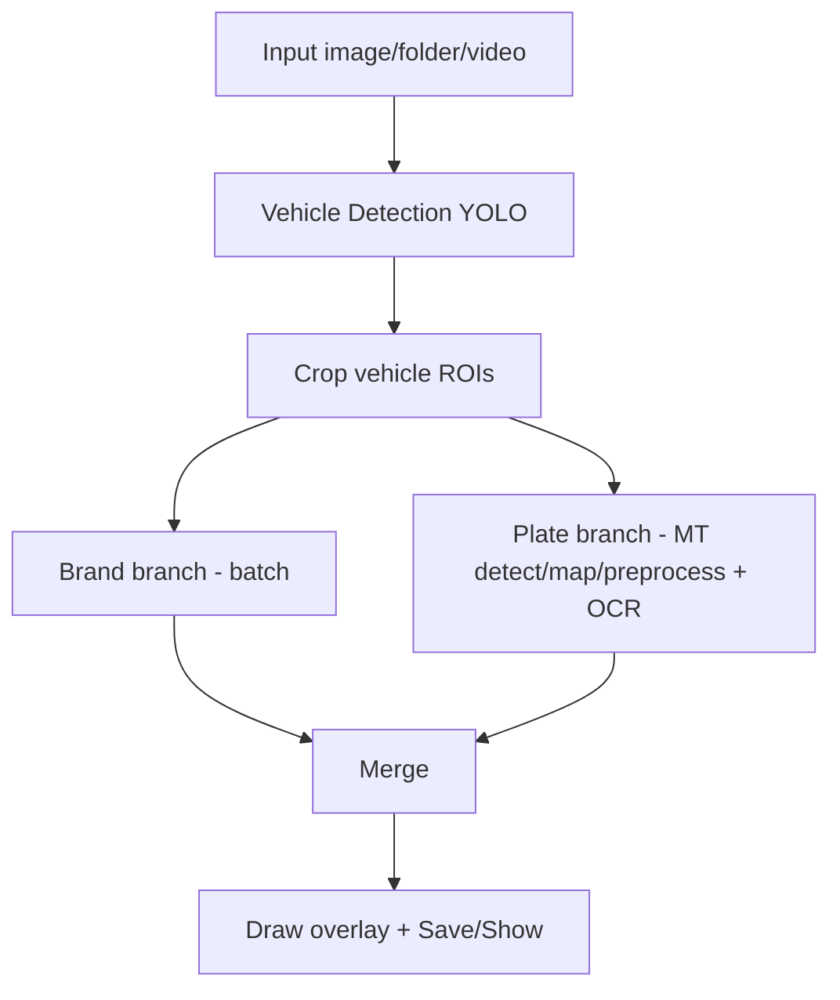

# Traffic Monitoring OCR Plate (C++ / ONNX Runtime / OpenCV)

Dự án nhận diện phương tiện, phân loại hãng xe và OCR biển số bằng C++ với ONNX Runtime + OpenCV.

## 1) Tổng quan pipeline

Hỗ trợ input: `--image`, `--folder`, `--video`.

Luồng xử lý mỗi frame/ảnh:

1. **Vehicle detection (YOLO)** trên ảnh gốc.
2. **Crop vehicle ROI** từ bbox vehicle.
3. **Chạy song song 2 nhánh**:
   - **Brand branch**: batch classify hãng xe cho `car`.
   - **Plate branch**:
     - plate detect theo từng vehicle (multi-thread).
     - map bbox plate về ảnh gốc.
     - crop + preprocess plate (multi-thread).
     - OCR (batch; nếu model OCR fix `batch=1` thì chạy multi-thread theo từng ảnh).
4. **Merge kết quả** vehicle + plate + OCR text/conf.
5. **Draw overlay** và xuất ảnh/video.

Sơ đồ:



ONNX Runtime đã được vendor sẵn trong `third_party/onnxruntime`.

## 2) Yêu cầu

- Linux (khuyến nghị Ubuntu 22.04)
- `apt`
- CMake + compiler hỗ trợ C++23

`setup.sh` cài sẵn:

- `build-essential`
- `cmake`
- `pkg-config`
- `libopencv-dev`

## 3) Quick start

Từ root dự án:

```bash
./setup.sh
./build.sh
cd build
../run.sh --image ../img/1.jpeg
```

Nếu script chưa executable:

```bash
chmod +x setup.sh build.sh run.sh
```

## 4) Build

Mặc định build 2 target: `main` và `benchmark`.

```bash
./build.sh
```

Tùy chọn:

- `--build-type <type>` (mặc định `Release`)
- `--jobs <n>`
- `--clean`
- `--target <name>` (lặp được)

Ví dụ:

```bash
./build.sh --build-type Debug --jobs 8
./build.sh --clean --target benchmark
```

Output:

- `out/build/bin/main`
- `out/build/bin/benchmark`

## 5) Chạy ứng dụng

### Main mode (mặc định)

- `--image <path_anh>`
- `--folder <path_thu_muc_anh>`
- `--video <path_video>`

Tùy chọn:

- `--show` / `--no-show`
- `--nosave` (chỉ áp dụng cho `--image`, `--video`)

Ví dụ:

```bash
../run.sh --image ../img/1.jpeg
../run.sh --image ../img/1.jpeg --nosave
../run.sh --folder ../img
../run.sh --video ../video.mp4 --show --nosave
```

Ghi chú video:

- infer theo chu kỳ `app_config::kVideoInferEveryNFrames` (mặc định 5), các frame giữa chu kỳ tái sử dụng overlay gần nhất.

### Benchmark mode

Chạy từ thư mục `build`:

```bash
../run.sh --benchmark --image ../img/10.jpeg --warmup 3 --runs 10
```

Nếu chưa build, `run.sh` sẽ yêu cầu chạy `./build.sh` trước.

## 6) Ý nghĩa benchmark metrics

- `vehicle detect`: thời gian detect vehicle trên ảnh gốc.
- `vehicle crop`: thời gian chuẩn bị crop vehicle.
- `brand branch`: tổng thời gian nhánh brand.
- `brand classify`: thời gian infer model brand thuần.
- `plate branch`: tổng thời gian nhánh plate.
- `plate detect`: thời gian detect plate trên vehicle crops.
- `plate map`: map bbox plate về ảnh gốc.
- `plate crop/pre`: crop + preprocess plate cho OCR.
- `plate ocr`: thời gian OCR.
- `merge`: ghép kết quả cuối.
- `total pipeline`: end-to-end infer một lần.

Vì brand/plate chạy song song:

`total` gần với `vehicle + crop + max(brand_branch, plate_branch) + merge + overhead`.

## 7) Cấu hình

Thiết lập trong `include/app_config.h`:

- `kVehicleModelPath`
- `kPlateModelPath`
- `kBrandCarModelPath`
- `kOcrModelPath`
- `kVehicleConfThresh`
- `kPlateConfThresh`
- `kNmsIouThresh`
- `kOcrConfAvgThresh`

## 8) Docker

```bash
docker build -t traffic-monitoring .
docker run --rm -v "$PWD/img:/app/img" traffic-monitoring --image /app/img/1.jpeg
docker run --rm -v "$PWD/img:/app/img" --entrypoint /app/benchmark traffic-monitoring --image /app/img/1.jpeg --warmup 5 --runs 10
```

## 9) Cấu trúc mã nguồn

- `src/main.cpp`: CLI + luồng image/folder/video.
- `src/frame_annotator.cpp`: infer overlay + draw.
- `src/benchmark.cpp`: benchmark theo stage.
- `src/yolo_detector.cpp`: infer YOLO (batch + single).
- `src/ocr_batch.cpp`: OCR batch, fallback multi-thread khi model fix `batch=1`.
- `src/brand_classifier.cpp`: classify brand.
- `src/utils/plate_parallel.cpp`: tiện ích plate detect/map/preprocess song song.
- `src/utils/parallel_utils.cpp`: tiện ích tính số worker dùng chung.

