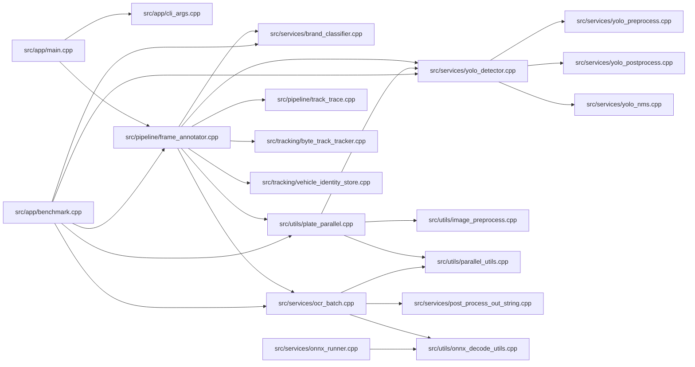

# So Do Call Graph File-to-File

So do nay o muc file, tap trung vao luong goi/chay chinh (runtime) va phu thuoc noi bo quan trong.

## Ghi chu pham vi
- Day la call/dependency graph muc file trong luong chinh app/pipeline/services.
- Khong ve tung ham chi tiet de tranh roi.
- Hai file legacy o src/ goc khong dua vao graph chinh vi flow hien tai su dung src/app + src/pipeline.

## Layering nhanh
- App layer: src/app/*.cpp
- Pipeline layer: src/pipeline/*.cpp
- Service layer: src/services/*.cpp
- Tracking layer: src/tracking/*.cpp
- Utility layer: src/utils/*.cpp
