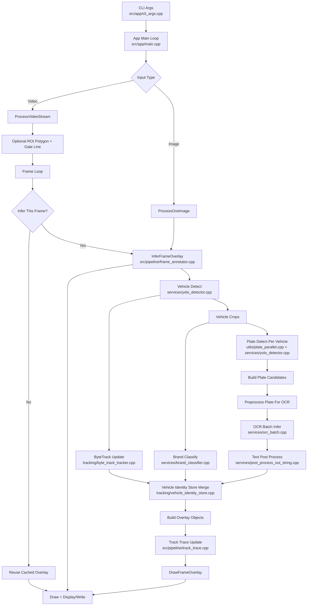

# So Do Mermaid Toan Bo Pipeline

## Ghi chu nhanh
- Infer frame duoc throttle theo cau hinh N frame de giu FPS.
- Brand va plate/OCR la 2 nhanh phu tro cho tung vehicle.
- Identity store dung de on dinh ket qua brand/plate qua nhieu frame.
